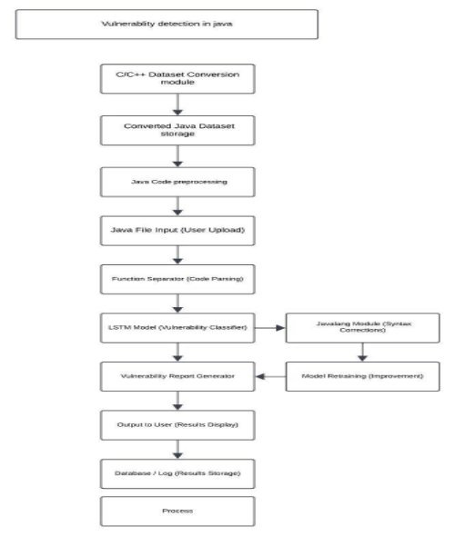
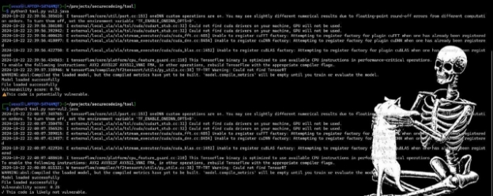
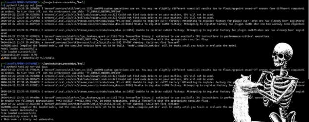

**Vulnerability Detection in Java Code Using LSTM Model**

1. **Introduction**

Software security is a crucial concern for developers, as vulnerabilities left undetected can lead to severe exploits. Datasets such as **MegaVul** focus on C/C++ vulnerabilities, but Java, a widely used language, lacks equivalent datasets. This project extracts Java code from the MegaVul dataset using a method and trains an LSTM model to detect vulnerabilities in Java code. The goal is to create a model that automatically classifies Java code as vulnerable or non-vulnerable and build a tool that assists developers in detecting security issues early.

2. **Problem Statement**

The MegaVul dataset, which focuses on C/C++ vulnerabilities, does not directly provide Java code snippets. Our project extracts Java code from MegaVul, trains an LSTM model for vulnerability detection in Java, and builds a tool that classifies Java code as vulnerable or non-vulnerable. This effort provides Java developers with a reliable solution for identifying vulnerabilities.

3. **Dataset Overview**

MegaVul is a large-scale dataset of C/C++ vulnerabilities containing 17,380 vulnerabilities and 322,168 non-vulnerable functions (2406.12415v1). However, to apply this dataset to Java, we needed to extract relevant Java code snippets.

4. **Dataset Extraction Using the Method**

1. ***Introduction to Extraction Process***

The extraction process involves identifying Java code within the MegaVul dataset and filtering out relevant functions for vulnerability detection. The process is:

- **Precise**: Targets only valid Java snippets.
- **Efficient**: Quickly processes large datasets.
- **Structured**: Maintains the integrity of extracted code.

2. ***Extraction Process***

We used a code extraction method to obtain Java functions from the MegaVul dataset in the following steps:

- **Identifying Java Code**: The dataset was analyzed to locate Java functions embedded in the MegaVul dataset.
- **Syntax Tree Analysis**: Extracted code snippets were processed to ensure they adhere to Java syntax.
- **Filtering and Cleaning**: Non-Java code and incomplete snippets were removed, ensuring high-quality data.
- **Java-Specific Augmentation**: After extracting Java code, we augmented it with Java-specific vulnerabilities, such as SQL injection, deserialization issues, and improper exception handling.

5. **Methodology**

1. ***Data Preprocessing***
- **Code Cleaning**: We preprocessed the code snippets by replacing unmatched quotes and handling common issues.
- **Tokenization**: The Java code snippets were tokenized using the javalang tokenizer, breaking them into meaningful tokens like keywords, literals, operators, etc.
- **Padding**: Token sequences of varying lengths were padded to a uniform length for model training.

2. ***Class Weights***

Due to the class imbalance (fewer vulnerable snippets), class weights were computed to ensure the model paid adequate attention to the vulnerable class during training.

6. **Model Architecture**

The LSTM model was designed to learn patterns from tokenized Java code sequences:

- **Embedding Layer**: Converts tokenized Java code into dense vectors.
- **LSTM Layer**: A 128-unit LSTM layer captures sequential relationships in the code tokens.
- **Dense Layer**: A fully connected layer with 64 units and ReLU activation.
- **Dropout**: A 50% dropout rate to prevent overfitting.
- **Output Layer**: A sigmoid-activated layer for binary classification (vulnerable vs. non-vulnerable).

```python
model = tf.keras.Sequential([
    tf.keras.layers.Embedding(input_dim=vocab_size, output_dim=128, input_length=maxlen),
    tf.keras.layers.LSTM(128, return_sequences=False),
    tf.keras.layers.Dense(64, activation='relu'),
    tf.keras.layers.Dropout(0.5),
    tf.keras.layers.Dense(1, activation='sigmoid')
])
```

The model was compiled using the **Adam optimizer** and **binary cross-entropy loss**, and trained for 5 epochs.



7. **Training and Evaluation**

1. ***Training***

The LSTM model was trained on the extracted and augmented Java dataset. Class weights were applied during training to handle class imbalance, and the model converged over 5 epochs, improving in accuracy.

2. ***Evaluation***

The model’s performance was evaluated using metrics such as accuracy, precision, recall, and F1-score. The initial results indicated the model’s ability to classify Java code snippets as vulnerable or non-vulnerable.

8. **Tool for Vulnerability Detection**

We built a tool that predicts vulnerabilities in Java code snippets using the trained LSTM model. This tool:

1. **Preprocesses** the input code snippet.
2. **Tokenizes** and converts the code into a sequence of tokens.
3. **Classifies** the code as either vulnerable or non-vulnerable using the trained model.

```python
def predict_vulnerability(code_snippet):
    code_snippet = preprocess_code(code_snippet)
    tokenized_code = ' '.join(tokenize_java_code(code_snippet))
    seq = tokenizer.texts_to_sequences([tokenized_code])
    padded_seq = pad_sequences(seq, padding='post', maxlen=maxlen)
    prediction = model.predict(padded_seq)[0][0]
    return 'Vulnerable' if prediction > 0.5 else 'Not Vulnerable'
```

9. **Challenges and Limitations**
- **Dataset Extraction**: Extracting high-quality Java code from MegaVul required precise filtering and validation.
- **Class Imbalance**: Vulnerable code snippets were less frequent, requiring careful handling of class weights during training.
- **Complexity**: More advanced models could be explored for better performance.

10. **Results**

The LSTM model successfully classified Java code snippets as vulnerable or non-vulnerable. With the extracted dataset, the tool provided accurate results and can be a valuable addition to code review processes for Java developers.

11. **Output Screenshots**






12. **Conclusion**

Using **a code extraction method**, we efficiently extracted Java code from the MegaVul dataset, augmented it with Java-specific vulnerabilities, and trained an LSTM model for vulnerability detection. The resulting tool is capable of analyzing Java code and identifying vulnerabilities, providing significant support to developers in ensuring code security.

13. **Future Work**
- **Advanced Models**: Future work could involve experimenting with Bi-LSTMs, GRUs, or transformer-based models like **CodeBERT** to improve accuracy.
- **Dataset Expansion**: Adding more real-world Java vulnerabilities will improve the dataset and model generalization.
- **Real-World Application**: Integration into CI/CD pipelines for real-time vulnerability detection in Java projects could enhance the tool’s practical utility.

14. **References**
- Chao Ni et al. (2024). *MegaVul: A C/C++ Vulnerability Dataset with Comprehensive Code Representations*. MSR ’24 (2406.12415v1).
